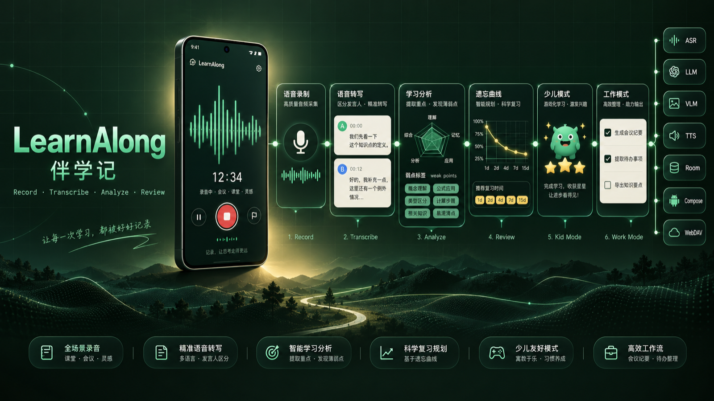
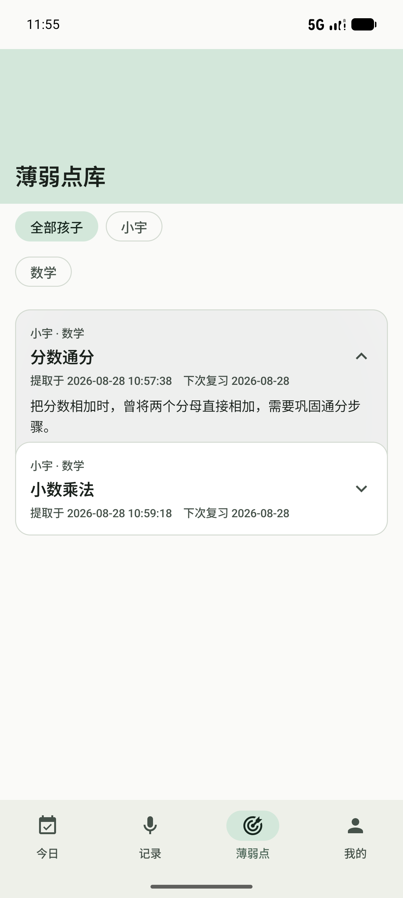
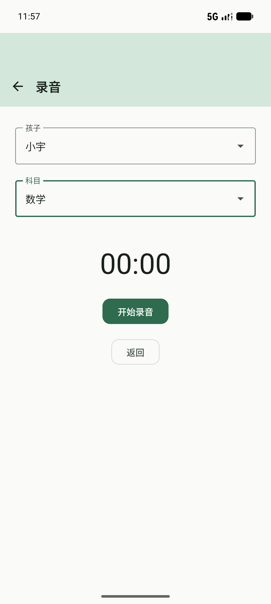
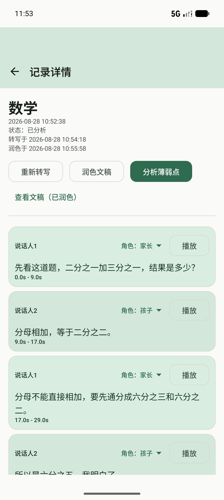
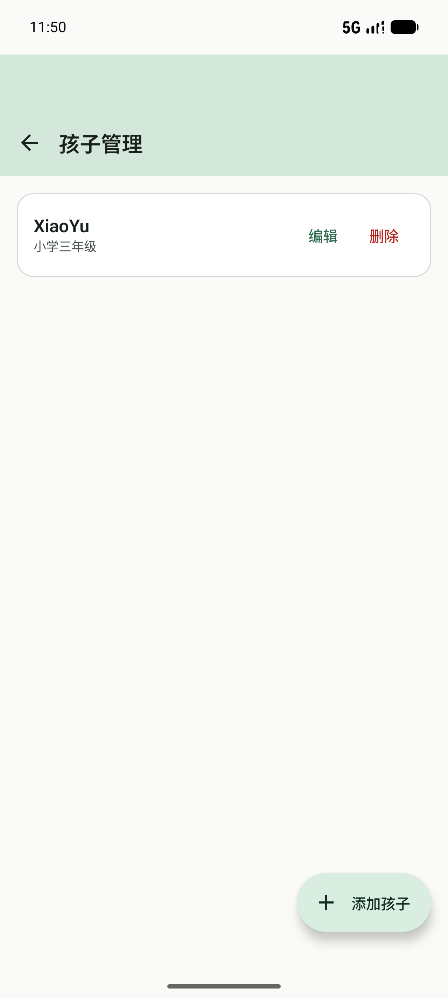
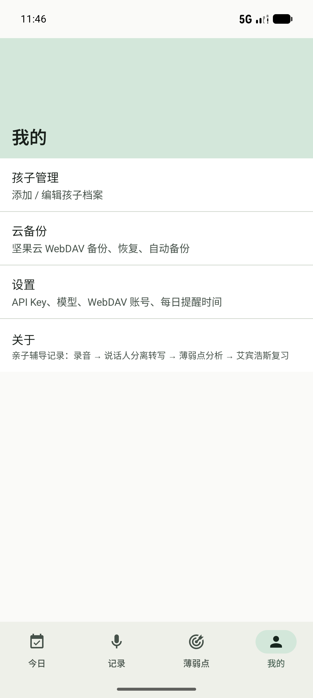
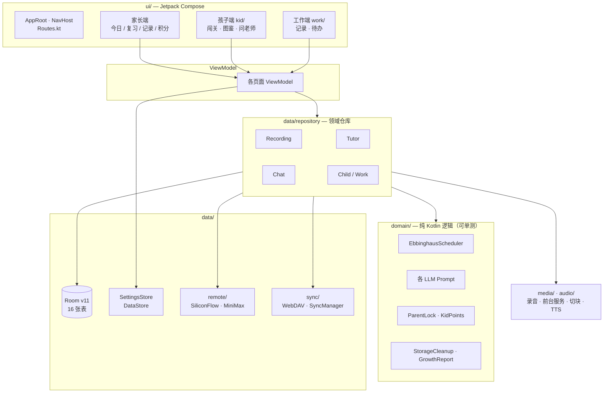
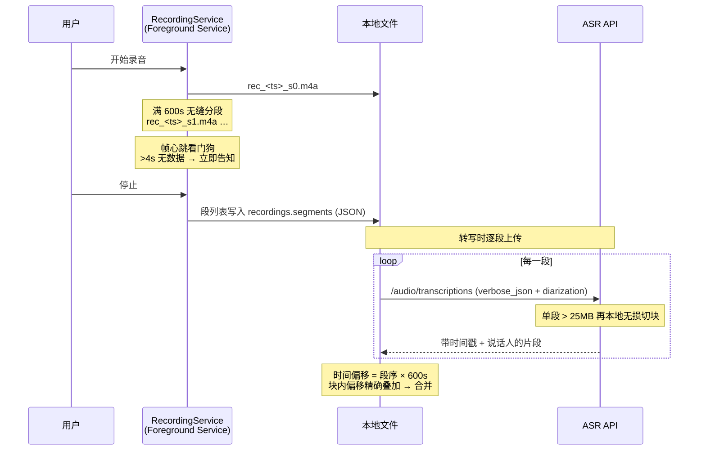

<div align="center">



# LearnAlong · 伴学记

**Turn every tutoring session into a review plan you can actually execute.**
把每一次辅导，变成真正能执行下去的复习计划。

*Record → Transcribe (with speaker diarization) → Find weak points → Schedule spaced review → Let the kid practise.*

[](#-快速开始--quick-start)
[](#-技术栈--tech-stack)
[](#-技术栈--tech-stack)
[](#-技术栈--tech-stack)
[](#-架构--architecture)
[](#-隐私与数据--privacy--data)
[](LICENSE)
[](CONTRIBUTING.md)

</div>

---

## 这是什么 · What is this

**中文** — LearnAlong（伴学记）是一个**本地优先（local-first）的 Android 家庭教育工具**。家长辅导孩子时按下录音，它会把整段对话转写成分角色的逐字稿，用大模型找出孩子真正没掌握的知识点，自动排进**艾宾浩斯间隔复习**计划；孩子端则把这些复习任务做成闯关，还会用语音陪孩子一步步想明白。

**English** — LearnAlong is a **local-first Android app for parents who tutor their own kids.** Hit record, and it turns the whole session into a speaker-labelled transcript, uses LLMs to surface the knowledge points the child genuinely missed, and schedules them into a spaced-repetition (Ebbinghaus) plan. A separate kid mode turns those tasks into a levelled quest, with a voice tutor that walks the child through the reasoning instead of handing over the answer.

> 这不是又一个「录音转文字」App。录音只是入口，**真正被解决的是「辅导完了以后怎么办」**。
> This is not another transcription app. Recording is just the door — the problem being solved is *what happens after the tutoring ends.*

---

## ✨ 核心能力 · Features

| | Feature | 说明 |
|---|---|---|
| 🎙️ | **录音绝不中断**<br/>Recording that survives everything | 录音跑在**前台服务**里，切后台、锁屏、来电话都不丢；满 10 分钟自动**无缝分段续录**，计时连续无感，播放时也能跨段精确 seek。提供音频帧心跳看门狗，一旦真的被系统杀掉立即告知，不再出现「计时在走、其实没录上」。 |
| 📦 | **大文件也不怕**<br/>Chunked upload for long audio | 超过接口上限的音频在本地**无损切块**（不重编码、不降音质），支持 `m4a` / `mp3` / `wav` / `aac`，逐块上传后按精确时间偏移合并转写结果。 `amr` / `ogg` 等不支持的格式自动转码。 |
| 🧩 | **格式嗅探与自愈**<br/>Format sniffing & self-healing | 扩展名和真实内容不符（如 `.aac` 实为 `m4a`）会按内容嗅探改名/重封装，修掉转写 400、时长显示 `00:00` 这类历史问题。 |
| 🗣️ | **说话人分离转写**<br/>Diarized transcription | 逐字稿带**时间戳 + 说话人**，一眼分清「谁说的」；转写结果可再经 LLM 润色成可读文本。 |
| 🎯 | **薄弱点分析**<br/>Weak-point analysis | 从整段辅导里提炼出孩子真正没掌握的知识点，而不是简单摘要。每条薄弱点可展开看依据。 |
| 📈 | **艾宾浩斯复习排期**<br/>Spaced-repetition scheduling | 纯 Kotlin 实现的间隔复习调度器（`domain/EbbinghausScheduler.kt`），负责排期推进与掌握度快照。排期逻辑与 UI 完全解耦，**可单元测试**。 |
| 🧒 | **孩子端闯关 + AI 语音辅导**<br/>Kid mode & Socratic voice tutor | 独立的闯关式界面（进入/退出需家长 PIN），星星战报、小怪兽图鉴（掌握度满翻面成勋章）。「问老师」是**苏格拉底式**引导对话，不直接给答案；支持按住说话、拍照提问（VLM 识图），回复自动语音播报。 |
| 💼 | **工作端：会议 / 谈话 / 通话**<br/>Work mode for meetings & calls | 同一套录音与转写管线，按场景生成 AI 纪要并抽取待办清单，待办分未办/已办两区。 |
| 🏅 | **积分乐园**<br/>Points & rewards | 家长给表现加分，孩子设定多个兑换目标，攒够即兑；积分流水可撤销误加，兑换有庆祝动效。 |
| ☁️ | **坚果云 WebDAV 备份**<br/>WebDAV backup & restore | 数据快照 + 配置 + 录音/照片媒体文件增量同步（同名同大小跳过），恢复时按主键 REPLACE upsert。已清理的音频不会被重新拉回。 |
| 🧹 | **存储空间管理**<br/>Storage management | 占用统计、已分析录音批量清理（可先备份到云端再删）、孤儿文件清理，带配额保护。 |
| 🔒 | **隐私优先**<br/>Privacy-first by design | API Key 只存在设备本地（DataStore），不经过任何自建中转服务器；云同步默认关闭，需你主动填写自己的 WebDAV 账号。 |

---

## 📱 界面预览 · Screenshots

> 以下为**真实运行截图**（早期构建，核心流程至今未变）。截图中的孩子「小宇」与辅导内容均为模拟器上的**演示数据**，非真实用户数据。

<div align="center">

| 录音准备 | 录音中 | 记录详情 · 分角色转写 |
|:---:|:---:|:---:|
|  |  |  |

| 薄弱点库 | 孩子管理 | 我的 |
|:---:|:---:|:---:|
|  |  |  |

</div>

---

## 🏗 架构 · Architecture

单 Activity + Compose，**不引入 DI 框架**，由手写的服务定位容器 `AppContainer` 组装依赖——依赖关系一眼可见，构建也更快。



### 录音 → 转写管线 · The recording pipeline

这是整个项目最花心思的一段：



### 数据层 · Data layer

Room **v11，16 张表**，全部迁移链集中在 `data/local/AppDatabase.kt`：`children`、`recordings`（含分段 JSON、润色文本、清理标记）、`transcript_segments`、`weak_points`、`review_tasks`、`mastery_history`、`recording_photos`、`chat_sessions`、`chat_messages`、`kid_stars`、`work_recordings`、`work_todos`，以及积分乐园的 `kid_points`、`point_tasks`、`point_goals`、`point_records`。

实体直接标注 `@Serializable`，因此**同一份对象既是数据库行，也是备份快照**，不需要另写一套 DTO。

---

## 🧰 技术栈 · Tech Stack

| 层 | 选型 |
|---|---|
| 语言 / 构建 | Kotlin 2.2.10 · Gradle 9.5 · AGP 9.3 |
| UI | Jetpack Compose · Material 3 · Navigation Compose（**单 Activity**） |
| 状态 | ViewModel + Kotlin Flow |
| 本地存储 | Room 2.7.2（KSP）+ DataStore Preferences |
| 网络 | Retrofit 2.11 + OkHttp 4.12 + kotlinx.serialization |
| 后台任务 | WorkManager（每日复习提醒）· Foreground Service（录音） |
| 依赖注入 | 手写 `AppContainer`（**刻意不引 Hilt/Koin**） |
| 最低版本 | `minSdk 28`（Android 9）· `targetSdk 37` |

**外部服务（全部需要你自己的 Key，且都在设备端直连）：**

| 用途 | 服务 | 端点 |
|---|---|---|
| ASR 转写（含说话人分离） | SiliconFlow | `/audio/transcriptions`（`verbose_json`） |
| LLM 润色 / 薄弱点分析 / 出题 / 苏格拉底对话 / 纪要 | SiliconFlow | `/chat/completions` |
| VLM 错题照片、拍照提问识图 | SiliconFlow | 同端点 vision 请求 |
| TTS 语音合成 + 家长声音复刻 | MiniMax | `MiniMaxApi.kt` |
| 备份 / 恢复 | 任意 WebDAV（默认适配坚果云） | `data/sync/` |

接口层刻意做了**宽松解析**（`TranscriptParser` 等），方便替换成别的兼容实现。

---

## 🚀 快速开始 · Quick Start

### 环境要求 · Requirements

- Android Studio（支持 AGP 9.3，需 JDK 17+）
- Android 9（API 28）及以上设备或模拟器
- 一个 SiliconFlow API Key（转写与分析必需）
- 可选：MiniMax Key（语音播报）、WebDAV 账号（云备份）

### 构建 · Build

```bash
git clone https://github.com/zhaopeinan/learnalong.git
cd learnalong

./gradlew assembleDebug          # 产出 app/build/outputs/apk/debug/app-debug.apk
./gradlew testDebugUnitTest      # 运行纯逻辑单元测试
```

安装到设备：

```bash
./gradlew installDebug
# 或
adb install -r app/build/outputs/apk/debug/app-debug.apk
```

### 首次配置 · First-run setup

App 首次启动会让你同意用户协议与隐私政策，随后进入「我的 → 设置」填写 Key：

| 设置项 | 路径 | 是否必需 |
|---|---|---|
| SiliconFlow API Key / 模型 | 我的 → 设置 → 模型服务 | **必需**（转写与分析） |
| MiniMax Key / 模型 / 音色 | 我的 → 设置 → 语音合成与音色 | 可选（语音播报） |
| WebDAV 地址 / 账号 / 密码 | 我的 → 设置 → 备份与存储 | 可选（云备份） |
| 家长密码 | 我的 → 设置 → 通用 | 可选（孩子端锁） |

> 💡 Key 只保存在本机 DataStore 中，不会上传到任何第三方中转服务器。
> 💡 空库首次启动会播种一份「示例·小明」演示数据方便你熟悉界面，从云端恢复成功后会**自动清除**这些示例数据。

---

## 🔀 三端模式 · Three Modes

`appMode` 决定底部导航与整体信息架构：

| 模式 | 定位 | 入口 |
|---|---|---|
| **家长端** `parent`（默认） | 4 个 tab + 中央凸起麦克风动作面板（问老师 / 开始录音 / 拍错题 / 相册选图 / 导入音频） | 默认 |
| **孩子端** `kid` | 闯关式复习：星星战报、今日做题（每条可语音播报）、小怪兽图鉴 | 我的 → 孩子端（进出需家长 PIN） |
| **工作端** `work` | 会议 / 工作谈话 / 通话录音或导入 → 逐字稿 → AI 纪要 + 待办 | 我的 → 工作端 |

另外支持从系统录音机等 App **分享音频**到 LearnAlong，先弹类目选择器（工作端会议 / 聊天通话 / 跟孩子的对话）再分流处理。

---

## 🔒 隐私与数据 · Privacy & Data

- **本地优先**：所有数据默认只存在设备上的 Room 数据库中；不登录、不注册、没有自建服务器。
- **直连服务商**：转写、分析与语音合成由设备直接请求 SiliconFlow / MiniMax，Key 由你自己持有。
- **云同步是可选动作**：只有你填写 WebDAV 账号并主动点备份，数据才会离开设备；`chat_sessions` / `chat_messages` 这类一次性辅导上下文**刻意不纳入备份**。
- **数据可带走**：备份文件是结构清晰的 JSON 快照（字段名与实体字段一致），使用 `ignoreUnknownKeys + 默认值` 容错，文件格式可自读、可迁移。
- ⚠️ AI 输出（转写、薄弱点、出题）**仅供参考**，请家长结合实际情况判断。

---

## 📂 项目结构 · Project Layout

```
app/src/main/java/com/example/asr/
├── AsrApplication.kt      # AppContainer（手写服务定位）+ 启动自动备份/提醒
├── MainActivity.kt        # 单 Activity 入口；ACTION_SEND audio/* 分享导入
├── audio/                 # 录音、前台服务（分段续录）、无损切块、导入、内置测试音频
├── data/
│   ├── local/             # Room v11（16 表）+ 迁移、实体、DAO、媒体存储、示例播种
│   ├── remote/            # SiliconFlow / MiniMax 客户端、各解析器、调试日志
│   ├── repository/        # Recording / Tutor / Chat / Child / Work
│   ├── settings/          # SettingsStore（DataStore）
│   └── sync/              # WebDAV 客户端、SyncManager、备份控制器
├── domain/                # 纯 Kotlin 逻辑：艾宾浩斯排期、各 Prompt、家长锁、积分、清理规则…
├── media/                 # 照片导入、TTS 合成与播放
├── worker/                # 每日复习提醒 WorkManager + 通知
└── ui/                    # Compose 页面：今日/复习/记录/详情/薄弱点/积分/孩子/设置/备份/
                           #   聊天（问老师）/孩子端/工作端/引导/关于 + 公共组件与主题
```

**测试**：`app/src/test/` 下有 19 个纯逻辑单元测试，覆盖
`EbbinghausScheduler`（排期）、`KidPoints` / `KidReward`（积分与激励）、`ParentLock`（家长锁）、
`AudioSplitter`（切块偏移）、`StorageCleanup`（清理规则）、各 `*Parser` / 各 `*Prompt`、
`WebDavUrl`、`GrowthReport`、`ChatText` 等。

```bash
./gradlew testDebugUnitTest
```

---

## 🗺 路线图与已知限制 · Roadmap & Known Limitations

坦诚地说，以下问题当前**尚未解决**：

1. 录音常驻通知**没有「停止」按钮**，只能点通知回到录音页停止（低优先级遗留）。
2. 转写 / 分析 / 润色等长任务在**应用被系统杀掉后不会续跑**，需回到详情页手动重试。
3. 每日复习提醒依赖 WorkManager 周期任务，**分钟级漂移**属系统行为，非缺陷。
4. MiniMax TTS 播报链接 **24 小时过期**，过期后重播会重新合成（`chat_messages.audioUrl` 仅作缓存）。
5. 包名仍是占位风格的 `com.example.asr`，未做正式发布签名的整理。

欢迎围绕以上任何一条提 Issue 或 PR。

---

## 🤝 贡献 · Contributing

非常欢迎 PR —— 请先读 [CONTRIBUTING.md](CONTRIBUTING.md)。几条硬性约定：

- 改动 `app/` 后**必须**跑通：`./gradlew assembleDebug && ./gradlew testDebugUnitTest`
- 提交信息使用 **Conventional Commits**（`feat:` / `fix:` / `docs:` / `chore:`）
- 新功能请同步更新 `CHANGELOG.md`
- 改动外部服务（ASR / LLM / VLM / TTS / 备份）时，请一并检查隐私文案是否需要更新

---

## 📄 许可 · License

本项目基于 [MIT License](LICENSE) 开源。

> **免责声明**：本项目与 SiliconFlow、MiniMax、坚果云等第三方服务商**无任何隶属关系**，也未获得其背书。使用第三方服务时请遵守各自的服务条款与定价规则。本项目为家庭教育辅助工具，AI 生成的转写、分析与题目均不构成专业教学或医疗建议。

<div align="center">

**如果这个项目对你有帮助，欢迎点一个 ⭐**

*Built with Kotlin & Jetpack Compose. 录音只是入口，复习才是答案。*

</div>
